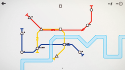
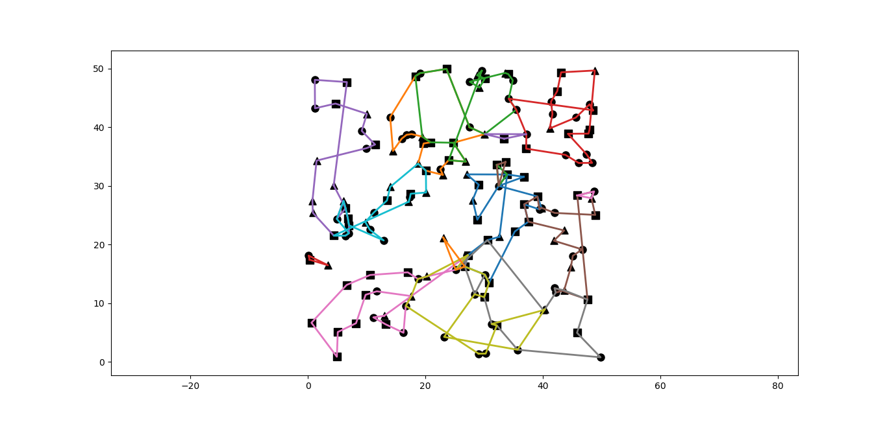
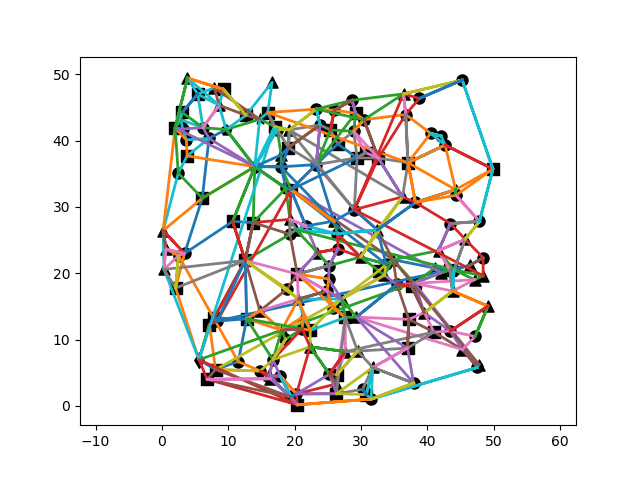
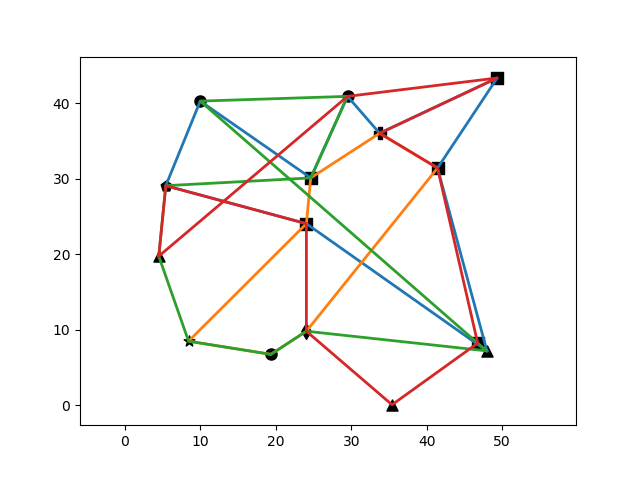
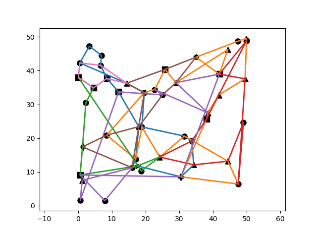
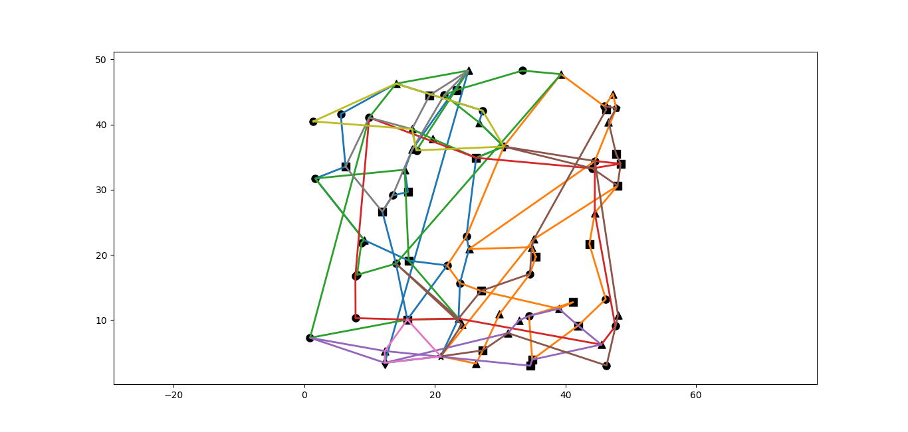
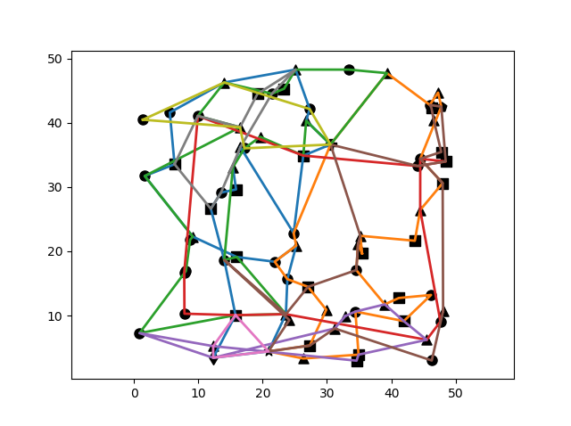

# mini-metro-solver

Avez-vous déjà joué au jeu Mini Metro ? Il s'agit d'un petit jeu de gestion, disponible sur mobile, PC, Switch et PS4 (https://play.google.com/store/apps/details?id=nz.co.codepoint.minimetro), où l'on doit gérer un réseau de métro en traçant judicieusement les lignes de métro et en leur attribuant un certain nombre, limité, de rames.

Au fur et à mesure que le jeu avance, le nombre de passagers et de stations à desservir augmente et il devient de plus en plus difficile de tous les satisfaire. Le jeu s'arrête alors lorsqu'une station de métro est surchargée de passagers.

L'objectif de ce projet est de calculer informatiquement une solution à ce jeu à un instant donné.

# Description du jeu

Il est donné au départ trois stations de formes différentes (triangle, cercle, carré), quatre lignes, deux locomotives et un nombre variable de ponts/tunnels. 

Dans chaque station, un certain nombre de passagers vont se présenter à chaque station de la manière suivante : un petit icône de rond signifie que le passager désire se rendre à une station ayant la forme d'un rond, idem pour les autres types de formes. A mesure que le jeu progresse, le nombre de stations sur la carte augmente (le taux d'apparition de passagers reste le même a priori).

Chaque locomotive possède par défaut six places et vont toutes à la même vitesse maximale; elles tendent à ralentir à l'apporche des stations puis à accélérer en repartant. Si deux locomotives se croisent alors qu'elles sont sur deux lignes différentes, elles ralentissent au moment du passage. Au cours du jeu, il est possible de mettre jusqu'à six rames par lignes.
Une ligne peut passer par un nombre quelconque de stations mais ne peut passer plusieurs fois par la même station. Il est en revanche possible de faire "boucler" les lignes sur elles-mêmes.

Chaque carte présente des obstacles naturels (montagnes, mer, bras de rivière) nécessitant l'utilisation d'un pont/tunnel si on veut faire traverser une ligne à travers l'obstacle.

Le jeu se déroule "en temps réel" avec une horloge à vitesse réglable (on peut même suspendre le temps), une semaine dans le jeu équivalant deux à trois minutes selon la vitesse de jeu.

Le but du jeu est de relier efficacement les stations entre elles à l'aide de lignes de métro, et d'attribuer les locomotives à chaque ligne, de façon à ce que le nombre de passagers attendant à une station n'excède pas un certain nombre (par défaut, 10).
Pour ce faire, chaque début de semaine, le joueur obtinet une locomotive et la possibilité de choisir entre un wagon (augmente la capacité d'un train par 6), une nouvelle ligne (8 maximum), une grande station (augmente la limite de passagers à 15 pour une station) et un pont/tunnel supplémentaire.

# Hypothèses de travail

Dans notre modèle, on s'attache à reproduire le plus fidèlement possible les fonctionnalités du jeu d'origine, cependant :
  - on enlève les potentiels obstacles (rivières, montagnes, etc.)
  - on suppose que les trains vont à vitesse constante, unitaire, sans ralentissement/accélération à l'approche des autres stations/trains
  - chaque passager met un temps unitaire à débarquer/embarquer sur le train
  - les distances entre stations sont supposées entières (on arrondit en pratique à l'entier supérieur pour conserver l'aspect métrique)
 
[L'implémentation du jeu est réalisée ici](Structures.py)

Pour améliorer les performances, les trajets qui doivent être pris par les passagers sont calculés à l'avance (avec l'algorithme de Dijkstra) et stockés dans chaque station pour chque forme-destination possible.

[Générateur aléatoire de réseaux pour tester ici](NetworkBuilder.py)

L'objectif du projet est d'obtenir une affectation des lignes/trains/wagons qui soit assez efficace pour un certain ensemble de stations. On considère donc ici avoir arrêté le temps et on cherche à construire notre réseau. Pour se ramener au cas général, il suffit de relancer l'algorithme à chaque fois qu'une nouvelle station apparaît.

# Génération d'une solution

On va chercher dans un premier temps à trouver une solution non nécéssairement optimale (ou même raisonnable) au problème donné. On considère deux approches :

  - [Approche gloutonne](Glutton.py) : ici, on utilise un algorithme glouton pour construire exactement huit lignes à partir de sommets choisis en fonction du nombre de lignes qui les desservit ainsi que du nombre de personnes y apparaissant. Plus précisément, l'algorithme part d'une ligne constituée d'un seul sommet censé être très fréquenté puis insère à la place la plus appropriée le sommet le plus approprié non encore dans la ligne. Les sommets n'ayant éventuellement jamais été ajoutés à une ligne sont ensuite rajoutés un à un à la ligne qui leur convient le mieux (avec la même méthode, en insérant à la meilleure place possible). Ici, la meilleure place est déterminée par le nombre de sommets de même forme placés consécutivement dans la ligne : plus celui-ci est grand, plus la rame de métro aura de difficulté à se vider de ses passagers (tous étant descendus à la première station) et les dernières stations de cette rangée consécutive ne pourront faire monter de passagers dans les rames pleines.
 

 
  Cet algorithme a l'avantage d'être très rapide, et d'obtenir exactement huit lignes dans notre solution. En revanche, il est loin d'être optimal, en général il ne convient même pas tel quel car certaines composantes connexes peuvent ne pas contenir toutes les formes possibles de station, il faut alors forcer les lignes ainsi obtenues à passer par chaque forme possible. De plus, à aucun moment on ne s'intéresse au nombre de trains/wagons à utiliser.
  
  - [Par les flots de passagers](Flow.py) : ici, on associe à un graphe dont les sommets sont les stations le graphe pondéré représentant le flot de voyageurs passant par les arêtes. Pour cela, on utilise extensivement l'algorithme de Dijkstra sur chaque station et on ajoute à chaque arête du chemin trouvé le nombre de passagers venant de cette station y passant par heure. On sélectionne alors une ligne d'une certaine façon et on retire au graphe des flots la quantité de passagers dont cette nouvelle ligne s'occupe en attribuant assez de trains pour qu'au moins une arête ait un flot nul. L'algorithme se termine lorsque toutes les arêtes sont parcourues par un nombre nul de voyageurs.
  
  
  
  Cet algorithme a l'avantage d'être assez rapide aussi et de prendre en compte le nombre de voyageurs qui doit être transporté. Cependant, comme on peut le voir, il n'y a pas de limite au nombre de lignes que l'on obtient ainsi. Il existe plusieurs façons de choisir le graphe de départ et les différentes lignes, ici j'utilise respectivement une triangulation de Delaunay (merci SciPy) bien meilleure qu'un graphe complet, et je choisis pour les lignes d'abord l'arête de coût minimal puis je complète la ligne en prenant des arêtes de coûts croissant.

# Amélioration d'une solution

Ayant obtenu une solution (plus ou moins), on va tenter de l'améliorer, ici principalement par recherche locale car je n'ai pas eu d'autre idée. La quantité que l'on cherche à minimiser ici est globalement le temps d'attente moyen des passagers, que l'on peut éventuellement multiplier par le nombre de lignes / trains selon le comportement des algorithmes (on est obligés de procéder au cas par cas en fonction du nombre de stations).
  
  - [Avec OPT](OPT.py) : on applique ici une stratégie du problème du voyageur de commerce, les algorithmes OPT, qui opèrent par permutation de sommets. Une telle stratégie ne fonctionne que sur les lignes cycliques. Ici, on ne va pas plus loin que la permutation de trois sommets. L'algorithme est assez peu efficace dans le cas général mais dans le contexte présent où l'on opère avec des lignes de taille assez réduite (maximum 20 stations) assez performant en réalité. Il reste cependant très lent à cause des lourdes structures de données employées (2h à 75 stations).
  
  - [Par mutations aléatoires](Genetic.py) : partant de notre solution clonée, on applique un certain nombre de transformations à une "population" de solutions et on conserve les changements les plus favorables. Les opérations se réalisent avec une certaine probabilité :
    - Insérer une station à une ligne 5%
    - Retirer une station à une ligne 5%
    - Ajouter un train à une ligne 5%
    - Changer la capacité d'un train 5%
    - Tenter de fusionner (= mettre bout à bout) / croiser deux lignes 80%

  Plutôt qu'un algorithme génétique (simulant la reproduction sexuée) on fait une recherche locale aléatoire (parthénogenèse si l'on veut). L'algorithme est assez lent à converger même pour un petit nombre de sommets, à 75 stations il faut 500 générations environ (6h de temps d'exécution) avant que le coût se stabilise.
  

Contrairement à ce que l'on pourrait croire, l'avant-dernière configuration (OPT avec le temps d'attente moyen) est plus efficace que la dernière (OPT avec la distance euclidienne), pourtant bien plus agréable à l'oeil.

# Pistes pour la suite

Il pourrait être intéressant de rendre la génération de réseaux aléatoires plus ergonomique avec une interface utilisateur, pour l'instant tout doit être fait manuellement.

